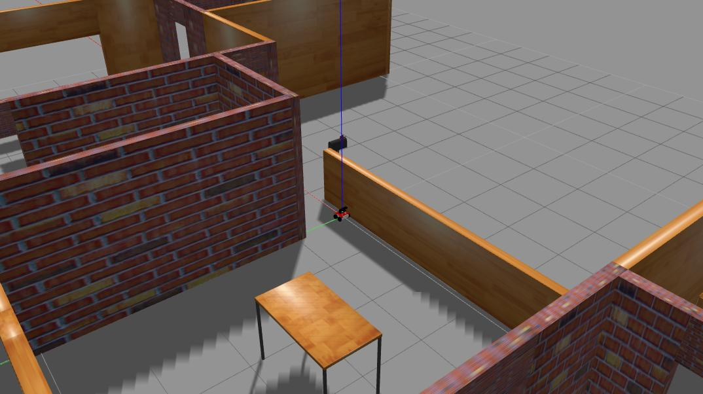
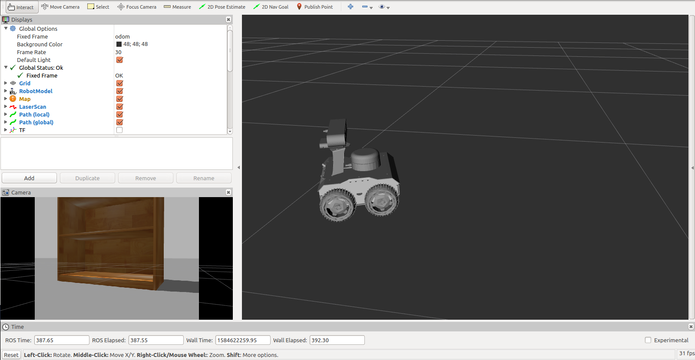

# husarion-rosbot-2-gazebo-simulation
Repository for Husarion ROSbot 2.0 simulation in gazebo and rviz with ORB_SLAM


### Brief Explanation

* **rosbot_description** specifies the entire robot structure as links and joints and can launch the model in rviz.
* **rosbot_gazebo** launches the model in the gazebo environment and contains different simulation worlds.
* **learning_joy** teleop_joy stick node for teleoperating ROSbot2 with xbox 360 gamepad
* **rosbot_navigation** launches teleop_keyboard node
* **ORB_SLAM** contains ORB_SLAM package for ROSbot2

### Install gazebo-ros control

```
sudo apt-get install ros-kinetic-gazebo-ros-pkgs ros-kinetic-gazebo-ros-control
```
### Simulating ROSbot 2 in Gazebo along with Rviz and ORB_SLAM

Download gazebo_model from the following link:
```
https://bitbucket.org/osrf/gazebo_models
```
In a new terminal clone the repositroy
```
hg clone https://marslanali800@bitbucket.org/osrf/gazebo_models
```
After cloning the gazeb0_model, add the following line to your `~./bashrc` script.
```
sudo gedit ~/.bashrc
export GAZEBO_MODEL_PATH=[...]/models:$GAZEBO_MODEL_PATH
```
For instace, if your clone your gazebo model in your home folder then it should be like this.
```
export GAZEBO_MODEL_PATH=/home/arslanali/gazebo_models:$GAZEBO_MODEL_PATH
```

### complining the package
In new terminal
```
mkdir -p ~/catkin_ws/src

cd catkin_ws/src

git clone https://github.com/Marslanali/husarion-rosbot-2-gazebo-simulation.git

catkin_make
```
Now Load the Gazebo and Rviz simulator in separate terminals using the following commands:
```
roslaunch rosbot_gazebo rosbot_gazebo_rviz_demo3.launch
```

#### Running keyboard teleop:
The ~/catkin_ws/src/rosbot_navigation folder contains the *rosbot_teleop.launch* file, which contain a teleop node.

Start the teleop node:
```
roslaunch rosbot_navigation rosbot_teleop.launch
```

#### Running Xbox 360 gamepad teleop:
The ~/catkin_ws/src/learning_joy folder contains the *turtle_joy.launch* file, which contain a turtle_joy node.

```
roslaunch learning_joy turtle_joy.launch
```

#### Getting RGB image to display
```
rosrun image_view image_view image:=/camera/rgb/image_raw
```
#### Simulation screenshots

<p align="left">
     
   
  <br/>
  Fig. 1. Gazebo and Rviz simualtion of ROSbot2
</p>


<p align="left">
  
  <br/>
  Fig. 2. ORB_SLAM view
</p>


### Demo Videos

[https://www.youtube.com/watch?v=Xm3ef-apk04&t=2s](https://www.youtube.com/watch?v=Xm3ef-apk04&t=2s)

[https://www.youtube.com/watch?v=G2Vk4WQwM2U&t=66s](https://www.youtube.com/watch?v=G2Vk4WQwM2U&t=66s)

#### Running Xbox 360 gamepad teleop:
The ~/catkin_ws/src/learning_joy folder contains the *turtle_joy.launch* file, which contain a turtle_joy node.

```
roslaunch learning_joy turtle_jhttps://www.youtube.com/watch?v=G2Vk4WQwM2U&t=66soy.launch
```

### Extra

### Running webcame camera node on second laptop and ORB_SLAM subscribe use it in first laptop

#### For machine 1 (Subscriber and running roscore, ORB_SLAM and, Rviz)
```
sudo apt-get install ros-kinetic-camera-umd
```

Now in a new terminal, launch uvc_camera_node with following command
```
rosrun uvc_camera uvc_camera_node
```
To view in image_view, run the following commmand
```
rosrun image_view image_view image:=/image_raw _image_transport:=compressed
```

#### For machine 2 publisher running camera node
```
sudo apt-get install ros-kinetic-camera-umd
```
Now in a new terminal, launch uvc_camera_node with following command
```
rosrun uvc_camera uvc_camera_node
```
To view in image_view, run the following commmand
```
rosrun image_view image_view image:/=image_raw _image_transport:=compressed
```
Add the following to your `~/.bashrc` script. Replace your ip idress of second machine.
```
export ROS_MASTER_URI=http://192.168.43.127:11311/
```
If you face any difficulty, feel free to drop an email at arslanali800@hotmail.com
